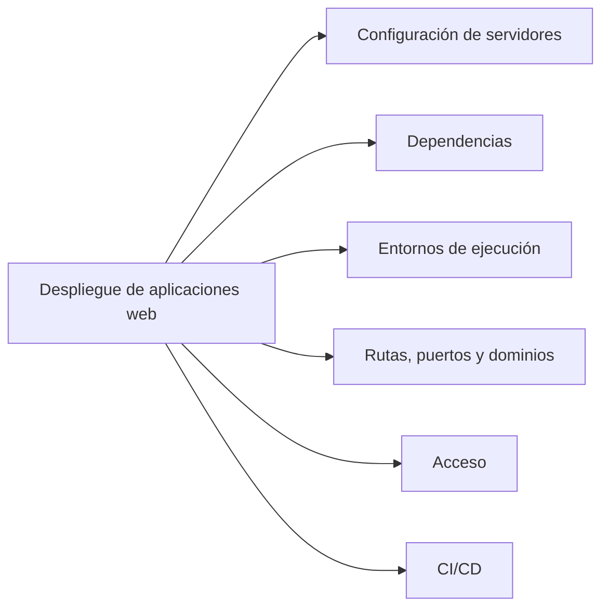
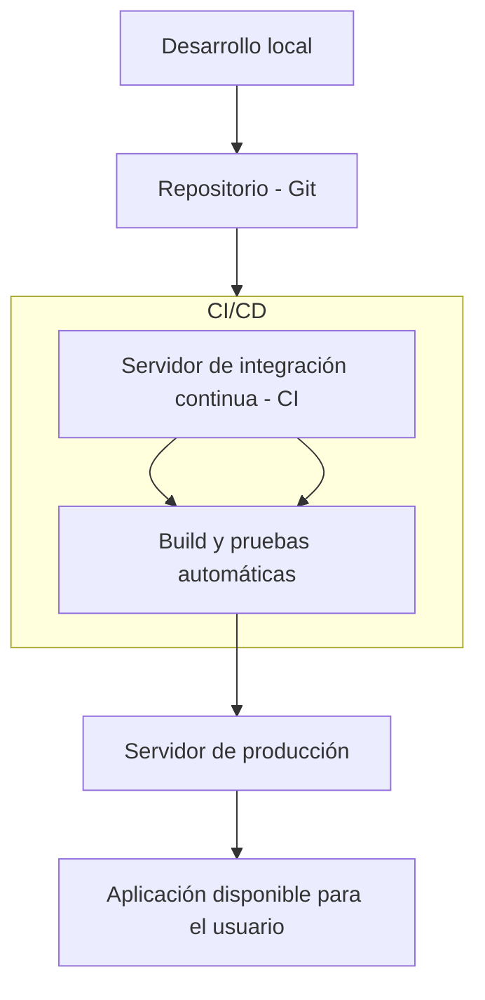
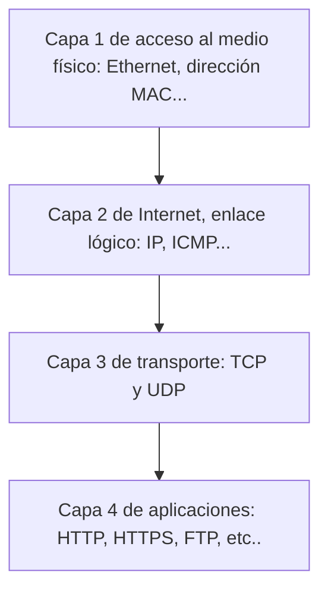
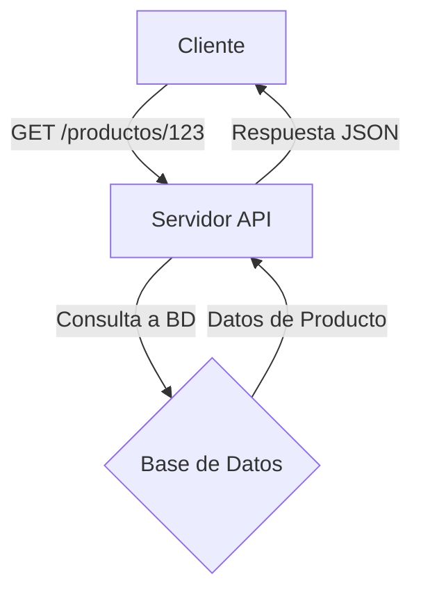
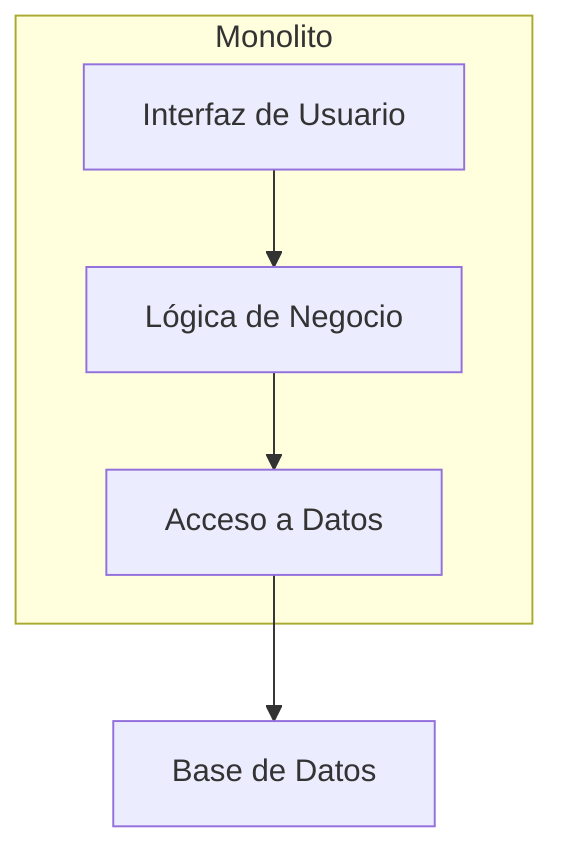
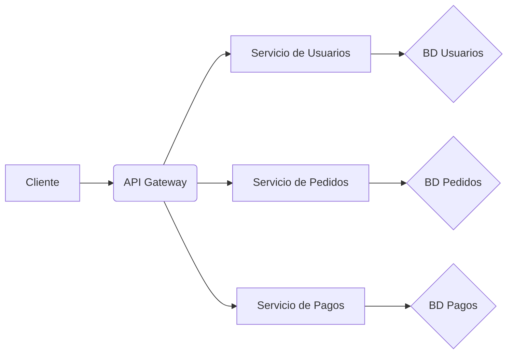
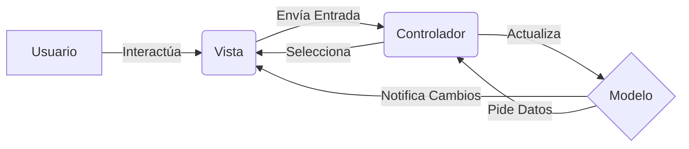
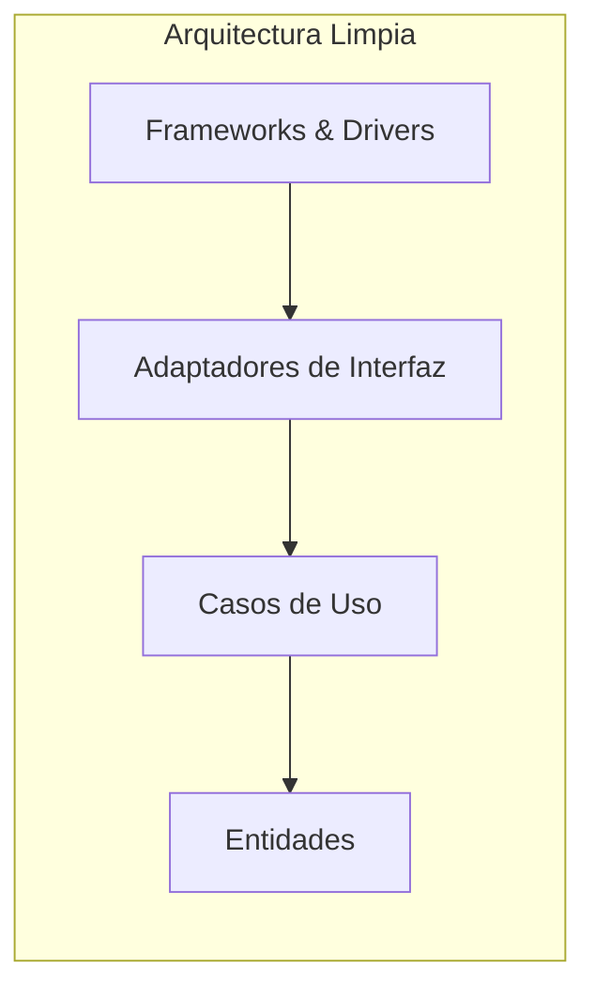

# 1. Arquitecturas web

https://codefinity.com/es/blog/How-to-use-Spring-with-the-IntelliJ-Community-Edition

## 1.1. Despliegue de aplicaciones web

### 1.1.1. Definición de "Despliegue de aplicaciones web"

El **despliegue de una aplicación web** consiste en el conjunto de tareas necesarias para que una aplicación desarrollada pueda ponerse en funcionamiento en un entorno real, accesible a través de la red (generalmente Internet o una intranet).

Consiste en preparar correctamente todos los componentes de la aplicación para que esta funcione tal y como se espera en la fase de producción. Esto incluye las siguientes tareas:

- Configuración de servidores web, de aplicaciones, de archivos y de bases de datos
- Instalación de las dependencias necesarias
- Establecimiento de los entornos de ejecución
- Configuración de rutas, puertos y dominios
- Confirmación del acceso correcto (HTTPS, firewalls, roles de usuario, etc.)
- Automatización de procesos de integración continua y despliegue continuo (CI/CD)

Las aplicaciones web funcionan siguiendo el **modelo cliente-servidor**, en el cual una parte del programa se ejecuta en el cliente y la otra en el servidor.

### 1.1.2 Fases comunes en un proceso de despliegue

Aunque varía según la tecnología y complejidad de la aplicación, el proceso suele incluir:

1. **Preparación del entorno de producción**

   * Elección del sistema operativo y configuración básica del servidor.
   * Instalación de software necesario (por ejemplo: Apache, Nginx, Tomcat, PHP, Java, Node.js, bases de datos).

2. **Transferencia de archivos**

   * Subida del código fuente y recursos mediante FTP/SFTP, Git o herramientas de automatización.

3. **Instalación de dependencias**

   * Uso de gestores como `composer`, `npm`, `pip`, `maven` o `gradle` para instalar librerías requeridas.

4. **Configuración del servidor**

   * Virtual hosts, puertos, certificados SSL, variables de entorno.

5. **Puesta en marcha y pruebas**

   * Lanzamiento de la aplicación.
   * Verificación del correcto funcionamiento en producción.

6. **Automatización (CI/CD)**

   * Uso de herramientas como GitHub Actions, GitLab CI, Jenkins, etc. para automatizar el despliegue tras cada cambio o versión.

## 1.1.3 Finalidad del despliegue

La finalidad de desplegar una aplicación web es hacerla accesible al público objetivo de la misma. Asimismo, su implementación garantiza la optimización del rendimiento, la seguridad y la eficiencia, así como el mantenimiento, la monitorización y la escalabilidad del sistema en un futuro. Es decir, el despliegue de una aplicación web convierte una aplicación en desarrollo en sistema funcional, público y operativo.

## 1.1.4 Pautas de despliegue en diferentes entornos

### Aplicación PHP en Apache (LAMP)

* Desarrollo local con XAMPP o MAMP.
* Subida al servidor web mediante FTP.
* Configuración de Apache (`VirtualHost`) y PHP.
* Base de datos MySQL importada desde archivo `.sql`.
* El sitio queda accesible desde un dominio o IP.

### Aplicación Java con Spring Boot en Tomcat

* Desarrollo en IntelliJ o Eclipse.
* Empaquetado como `.war` o `.jar`.
* Despliegue en un servidor Tomcat.
* Configuración de base de datos (PostgreSQL, MySQL).
* Uso de `application.properties` para definir rutas, puertos, credenciales, etc.

### Aplicación SPA (Single Page Application)

Una SPA es una aplicación web que interactúa con el usuario de forma dinámica, reescribiendo el contenido de la página con información procedente del servidor, en lugar de recargar la página completa. De esta forma, la aplicación web es más fluida y su comportamiento se asemeja más al de una aplicación de escritorio.

En una SPA, nunca se recarga la página, sino que el contenido se reescribe de forma asíncrona. Hay una gran cantidad de frameworks, como Angular o Vue.js, que tienen este enfoque.

* Frontend en React (SPA) desplegado en [Netlify](https://www.netlify.com/) o [Vercel](https://vercel.com/).
* Backend (API REST en Node.js o Django) desplegado en un VPS o contenedor Docker.
* Comunicación entre capas mediante [fetch/Axios](https://keepcoding.io/blog/fetch-o-axios/).
* Configuración de variables de entorno y seguridad [CORS](https://developer.mozilla.org/es/docs/Web/HTTP/Guides/CORS).

## 1.1.5 Repercusión del despliegue

El proceso de despliegue no solo marca el final del desarrollo, sino el **inicio de la operación real** de una aplicación. Su correcta ejecución tiene impacto directo en:

* **La disponibilidad del servicio**
* **La experiencia de usuario (UX)**
* **La seguridad de los datos**
* **La capacidad de mantenimiento y actualización**
* **El posicionamiento del proyecto frente a usuarios o clientes**

Errores en el despliegue pueden generar fallos graves en producción, caídas del servicio, fugas de información o pérdida de usuarios.

## 1.2. Protocolos

### 1.2.1. Modelo TCP/IP

El modelo TCP/IP es un conjunto de protocolos que permiten la comunicación entre los ordenadores pertenecientes a una red. La sigla TCP/IP significa Protocolo de control de transmisión/Protocolo de Internet. Proviene de los nombres de dos protocolos importantes incluidos en el conjunto TCP/IP, es decir, del protocolo TCP y del protocolo IP.

#### 1.2.1.1. Protocolos de la Capa de Internet: IP

El protocolo **IP (Internet Protocol)** es la columna vertebral del modelo. Su función principal es el **direccionamiento** y el **enrutamiento** de los paquetes de datos. Cada dispositivo conectado a una red tiene una dirección IP única (como una dirección postal) que identifica su ubicación.

* **Direccionamiento:** El protocolo IP asigna una dirección lógica a cada dispositivo, permitiendo que los paquetes de datos sean enviados desde un origen a un destino específico.
* **Enrutamiento:** Los routers utilizan las direcciones IP para determinar la mejor ruta que debe seguir un paquete para llegar a su destino. Es un servicio "sin conexión", lo que significa que no establece una conexión persistente antes de enviar los datos; simplemente los envía y espera que lleguen.

##### Direcciones lógicas y físicas

###### Dirección lógica (Protocolo IP)

La **dirección IP** (Protocolo de Internet) es una dirección lógica utilizada para identificar de forma única a un dispositivo dentro de una red, como Internet. Es un identificador que no está fijo al hardware del dispositivo, sino que es asignado y puede cambiar. La dirección IP se utiliza para el **enrutamiento**, permitiendo que los paquetes de datos viajen a través de múltiples redes hasta llegar a su destino correcto. Los routers utilizan las direcciones IP para determinar la ruta óptima para un paquete. Un ejemplo de dirección IP es `192.168.1.1` (en IPv4) o `2001:0db8:85a3:0000:0000:8a2e:0370:7334` (en IPv6). El protocolo **ICMP** (Protocolo de mensajes de control de Internet) trabaja con IP para enviar mensajes de error y diagnóstico, como cuando un destino no puede ser alcanzado.

###### Dirección física (Protocolo Ethernet)

La **dirección MAC** (Media Access Control) es una dirección física que identifica de forma única la tarjeta de red (NIC) de un dispositivo. A diferencia de la dirección IP, la dirección MAC está grabada de fábrica en el hardware y no se puede modificar. Esta dirección se utiliza para la comunicación dentro de una **red local** (LAN), como la que se utiliza en el protocolo **Ethernet**. La dirección MAC asegura que los datos se entreguen al dispositivo correcto en una misma red. Un ejemplo de dirección MAC es `00:1A:2B:3C:4D:5E`.

###### Enlace entre dirección física y lógica a través de ARP

El protocolo **ARP** (Address Resolution Protocol) es el responsable de enlazar la dirección lógica (IP) con la dirección física (MAC). Cuando un dispositivo en una red necesita comunicarse con otro dispositivo utilizando su dirección IP, pero no conoce su dirección MAC, utiliza ARP para resolver esta información.

El proceso es el siguiente:
1.  Un dispositivo A quiere enviar un paquete a un dispositivo B con dirección IP conocida, pero desconoce su dirección MAC.
2.  El dispositivo A envía una **petición ARP** (conocida como *ARP request*) a toda la red local, preguntando: "¿Quién tiene la dirección IP `192.168.1.100`? Por favor, dime tu dirección MAC".
3.  El dispositivo B, que reconoce su dirección IP en la petición, responde con un **mensaje ARP de respuesta** (*ARP reply*), que contiene su dirección MAC.
4.  Una vez que el dispositivo A recibe esta respuesta, almacena la dirección IP y MAC en una **tabla de caché ARP** para futuras comunicaciones, evitando tener que repetir el proceso cada vez.

#### 1.2.1.2. Protocolos de la Capa de Transporte: TCP y UDP

Esta capa se encarga de la comunicación de extremo a extremo entre aplicaciones. Aquí se encuentran dos protocolos clave:

* **TCP (Transmission Control Protocol):** Es un protocolo **orientado a la conexión** y **confiable**. Antes de enviar los datos, TCP establece una conexión entre el origen y el destino. Garantiza que los paquetes lleguen en el orden correcto y sin errores. Si un paquete se pierde, TCP lo reenvía. Por esta razón, se utiliza para aplicaciones que requieren una alta fiabilidad, como la transferencia de archivos, el correo electrónico y las páginas web.

* **UDP (User Datagram Protocol):** Es un protocolo **sin conexión** y **no confiable**. UDP envía los paquetes de datos sin establecer una conexión previa ni verificar si llegan a su destino. Es más rápido que TCP porque no tiene la sobrecarga de la verificación y reenvío. Se usa en aplicaciones donde la velocidad es más importante que la fiabilidad, como la transmisión de video en tiempo real (streaming), los juegos en línea y las llamadas de voz sobre IP (VoIP).

* **Puertos y Sockets:** Los puertos y sockets son conceptos esenciales en esta capa.
    * Un **puerto** es un número que identifica una aplicación o un servicio específico en un dispositivo. Por ejemplo, el puerto 80 es para HTTP y el 443 para HTTPS. Esto permite que múltiples aplicaciones compartan la misma dirección IP sin que los datos se mezclen.
    * Un **socket** es una combinación de la dirección IP y el número de puerto. Es un punto de conexión único que identifica de forma precisa una aplicación en una red, facilitando la comunicación entre dos programas.

#### 1.2.1.3. Protocolos de la Capa de Aplicaciones: HTTP, HTTPS, FTP

Esta es la capa que interactúa directamente con el usuario y las aplicaciones. Los protocolos aquí definen las reglas para que las aplicaciones intercambien datos.

* **HTTP (Hypertext Transfer Protocol):** Es el protocolo para transferir documentos en la World Wide Web. Define la forma en que los navegadores web solicitan páginas y cómo los servidores responden. Es un protocolo sin estado, lo que significa que cada solicitud del cliente es independiente de las anteriores. Su puerto es el 80.

* **HTTPS (Hypertext Transfer Protocol Secure):** Es la versión segura de HTTP. Utiliza los protocolos **SSL/TLS** para encriptar la comunicación entre el navegador y el servidor. Esto asegura que la información (como contraseñas o datos de tarjetas de crédito) viaje de forma segura y no pueda ser interceptada o leída por terceros. Su puerto es el 443.

* **FTP (File Transfer Protocol):** Es el protocolo estándar para la transferencia de archivos entre un cliente y un servidor en una red. FTP permite a los usuarios subir, descargar, borrar y gestionar archivos en un servidor remoto. Es un protocolo antiguo pero todavía se usa en muchos escenarios de transferencia de archivos. Su puerto es el 21 para conexiones de control y el 20 para conexiones de datos.

## 1.3. Perfiles de trabajo en el desarrollo web

En el desarrollo web, los perfiles laborales se dividen en tres: Front-end, Back-End y Full-Stack.

**Front-end** es la parte de la aplicación que interactúa con los usuarios y también es conocida como "el lado del cliente". Básicamente, es todo lo que vemos en la pantalla cuando accedemos a un sitio web o aplicación. Los lenguajes de este entorno, siempre hablando de entorno web, son HTML5, CSS3 y JavaScript. Es frecuente el uso de librerías como AJAX para la comunicación asíncrona con el servidor, de forma que se puedan obtener ciertos datos sin necesidad de actualizar la página completa. Hay multitud de frameworks que facilitan el trabajo front-end, como Angular, React, Vue, etc.

**Back-end** se refiere al interior de las aplicaciones que viven en el servidor y al que a menudo se le llama "lado del servidor". Este servidor recibe peticiones desde el cliente, que se procesan y permiten acceder a los distintos repositorios de datos (ficheros, bases de datos, etc.). Finalmente, se devuelve una respuesta al front-end. Los lenguajes más habituales del back-end son Java, Php, Python, C#, Ruby, etc. Hay multitud de frameworks que facilitan el trabajo en back-end, como Spring (Java), ASP.Net (C#), Django (Python), Node.js(Javascript), Laravel (PHP) o Symfony(PHP). 

Se conoce como **Full-Stack** a aquel perfil laboral en el cual el empleado trabaja tanto en front end como en back end.

Para profundizar en los conceptos, aquí tienes una explicación más detallada de cada punto, manteniendo una estructura clara y concisa.

## 1.4. Arquitecturas web

### 1.4.1. Aplicaciones Web

Una **aplicación web** es un sistema de software que se ejecuta en un servidor y al cual los usuarios acceden a través de un navegador web. Su arquitectura se fundamenta en el modelo **cliente-servidor**. El **cliente**, que es el navegador, envía solicitudes HTTP a un servidor. El **servidor** procesa estas solicitudes, ejecuta la lógica de negocio y, a menudo, interactúa con una base de datos para recuperar o almacenar información. Finalmente, el servidor envía una respuesta al cliente, que puede ser código HTML, CSS y JavaScript para renderizar la interfaz de usuario. Este modelo permite que la aplicación sea universalmente accesible desde cualquier dispositivo con un navegador, sin necesidad de instalación.

### 1.4.2. Aplicaciones API/REST

Una **API (Interfaz de Programación de Aplicaciones)** es un conjunto de reglas y protocolos que permiten a dos o más aplicaciones comunicarse entre sí. **REST (Representational State Transfer)** es un estilo arquitectónico para el diseño de APIs que se basa en el protocolo HTTP. Las **API RESTful** utilizan los verbos HTTP estándar (como `GET` para obtener datos, `POST` para crear, `PUT` para actualizar y `DELETE` para eliminar) para manipular recursos. A diferencia de las aplicaciones web tradicionales que devuelven HTML para ser renderizado, las APIs RESTful suelen devolver datos en formatos ligeros como JSON o XML, lo que las hace ideales para la comunicación entre diferentes tipos de clientes (aplicaciones móviles, aplicaciones de escritorio, otros servicios) y el servidor.

### 1.4.3. Aplicaciones Monolíticas

Una **aplicación monolítica** es un sistema de software donde todos los componentes funcionales, como la interfaz de usuario, la lógica de negocio y la capa de acceso a datos, están acoplados en una única base de código y se despliegan como una sola unidad. Este enfoque presenta ventajas en el inicio del proyecto, como una gestión más simple del despliegue y una comunicación interna más rápida entre componentes. 

Sin embargo, los **monolitos** pueden volverse difíciles de mantener a gran escala, ya que un cambio en una pequeña parte del código requiere la compilación y el despliegue de toda la aplicación. La escalabilidad también es un desafío, ya que para aumentar la capacidad de una función específica, es necesario escalar la aplicación completa.

En la actualidad, es frecuente ver otro tipo de arquitecturas.

### 1.4.4. Microservicios

La **arquitectura de microservicios** descompone una aplicación en una colección de servicios pequeños, independientes y acoplados de forma débil. Cada **microservicio** se centra en una funcionalidad de negocio específica y se comunica con otros servicios a través de APIs. Esta arquitectura ofrece mayor **resiliencia** (si un servicio falla, el resto puede seguir funcionando), **escalabilidad** (los servicios pueden escalarse individualmente según la demanda) y **agilidad** (los equipos pueden desarrollar y desplegar servicios de forma autónoma). Sin embargo, la complejidad de gestión y el despliegue de múltiples servicios pueden ser mayores.

## 1.4. Modelos

### 1.4.1. Modelo Vista Controlador - MVC

El **Modelo Vista Controlador (MVC)** es un patrón de diseño que separa una aplicación en tres componentes interconectados para lograr una clara separación de responsabilidades:

  * **Modelo**: Contiene la lógica de negocio y los datos de la aplicación. Es independiente de la interfaz de usuario.
  * **Vista**: Es la capa de presentación. Muestra los datos del modelo al usuario y captura la interacción del usuario.
  * **Controlador**: Actúa como intermediario. Recibe las entradas del usuario a través de la Vista, las procesa, interactúa con el Modelo para actualizar el estado de los datos, y luego selecciona la Vista adecuada para mostrar el resultado.

Este patrón mejora la **organización del código**, la **reutilización de componentes** y la **facilidad de prueba**, ya que cada componente puede ser probado de forma independiente.

### 1.4.2. Arquitectura de Microservicios

Como se detalló en el punto anterior, la **arquitectura de microservicios** es un modelo que organiza una aplicación como un conjunto de servicios granulares e interconectados. Cada servicio se enfoca en una funcionalidad de negocio específica y puede ser desarrollado, desplegado y escalado de forma independiente. Este enfoque contrasta con el monolítico y es ideal para aplicaciones grandes y complejas que requieren una alta disponibilidad, escalabilidad y una rápida evolución.

### 1.4.3. Arquitecturas Limpias (Clean Architecture)

Las **Arquitecturas Limpias**, popularizadas por Robert C. Martin ("Uncle Bob"), son un conjunto de principios de diseño que organizan el código en capas concéntricas para lograr la **independencia de frameworks, bases de datos e interfaces de usuario**. La regla fundamental es la **regla de dependencia**: las dependencias siempre deben apuntar hacia el interior.

  * **Capa Interna (Entidades y Casos de Uso)**: Contiene la lógica de negocio central, independiente de cualquier tecnología externa.
  * **Capas Externas (Adaptadores e Interfaces, Frameworks)**: Contienen la lógica de presentación, las bases de datos y los frameworks. Estas capas dependen de las capas internas, pero no al revés.

El objetivo es crear sistemas robustos, flexibles y altamente **testeables**, ya que la lógica de negocio puede ser probada sin necesidad de componentes de bases de datos, APIs web o interfaces de usuario.

# 2. Servidores web y servidores de aplicaciones

> **Criterios de evaluación:** 1c, 1d, 1g, 1h, 1i

## 2.1. Servidores Web

Un **servidor web** es un programa informático diseñado para servir contenido estático a los clientes a través del protocolo HTTP. Su función principal es recibir peticiones de navegadores web y entregar archivos como HTML, CSS, JavaScript e imágenes. Un servidor web es altamente eficiente en esta tarea, optimizando la entrega para miles de conexiones simultáneas con bajo consumo de recursos.

### 2.1.1. NGINX

**Nginx** es un servidor web y proxy inverso de alto rendimiento. Se distingue por su arquitectura asíncrona y orientada a eventos, lo que le permite manejar una gran cantidad de conexiones concurrentes de manera eficiente, sin crear un nuevo proceso o hilo para cada una. Esto lo convierte en una opción ideal para sitios web con mucho tráfico y para actuar como una capa intermedia entre los usuarios y los servidores de aplicaciones. A menudo, Nginx se utiliza para servir el contenido estático de una aplicación (como el *frontend*) y redirigir las peticiones dinámicas a un servidor de aplicaciones.

### 2.1.2. Proxy y Proxy Inverso

La palabra proxy viene del latín procuratio, que significa "administración" o "gestión en nombre de otro". Este término, a su vez, se deriva de procurator, que se refiere a un "administrador" o "agente".

En el contexto informático, el uso de "proxy" para describir un servidor intermediario que actúa en nombre de un cliente se basa directamente en este significado. El servidor proxy "procura" o "gestiona" la conexión por ti, actuando como tu representante.

Un **proxy** es un servidor que actúa como intermediario entre un cliente (como un navegador) y otro servidor. Su función principal es reenviar las peticiones de los clientes a Internet. Cuando un cliente se conecta a un servidor a través de un proxy, es el proxy quien realiza la solicitud al destino final. La respuesta del servidor web primero llega al proxy y luego es enviada al cliente. Un proxy se utiliza comúnmente para filtrar contenido, mejorar la seguridad, o para mantener el anonimato del cliente. 

Por otro lado, un **proxy inverso** actúa también como intermediario, pero su rol es el opuesto: protege y representa a uno o más servidores de destino, no al cliente. El cliente hace una petición a un servidor proxy inverso, y este servidor decide a qué servidor backend (o servidor de origen) la envía. La respuesta del servidor backend es luego reenviada al cliente a través del proxy inverso.

Los usos más comunes de un proxy inverso son:

- Balanceo de carga: Distribuye las peticiones entre múltiples servidores para evitar la sobrecarga de uno solo.

- Seguridad: Oculta la dirección IP y la arquitectura interna de los servidores backend, actuando como una capa de protección.

- Caching: Almacena en caché las respuestas estáticas para reducir la carga de los servidores de origen y acelerar la entrega de contenido.

- Manejo de SSL/TLS: Descarga la tarea de encriptación de los servidores backend.
-   -   SSL: Segure Socket Layers. Protocolo criptográfico de la capa de transporte.
-   -   TLS: Transport Layer Security, evolución de TLS.

La diferencia fundamental entre un proxy y un proxy inverso reside en quién se beneficia del servicio y a quién representa el proxy.

- **Un proxy representa al cliente** y opera en su nombre para acceder a recursos externos.

- **Un proxy inverso representa a los servidores de origen** y enmascara su identidad para los clientes, actuando como un punto de entrada centralizado.

## 2.2. Servidores de Aplicaciones

Un **servidor de aplicaciones** es un *framework* de software que proporciona un entorno de ejecución para la lógica de negocio de las aplicaciones. A diferencia de un servidor web, su propósito no es solo servir archivos, sino procesar peticiones complejas, interactuar con bases de datos, y generar contenido dinámico. Un servidor de aplicaciones puede estar optimizado para un lenguaje de programación específico, como Java, Python o Node.js.

### 2.2.1. Tomcat

**Tomcat** es un servidor de aplicaciones de código abierto para Java. Proporciona un entorno para ejecutar servlets, JavaServer Pages (JSP) y otras tecnologías de la plataforma Java. Tomcat recibe una petición, la procesa utilizando la lógica de negocio de la aplicación (por ejemplo, consultando una base de datos) y genera una respuesta, que a menudo es HTML. El uso de IntelliJ Ultimate simplifica el proceso de despliegue y depuración de aplicaciones Java directamente en un servidor Tomcat.

### 2.2.2. Pila AMP. Uso de XAMPP

La **pila AMP** (Apache, MySQL, PHP) es un conjunto de software de código abierto que se utiliza para el desarrollo de aplicaciones web dinámicas. Es una de las combinaciones más populares para la creación de sitios web.
* **A**pache: El servidor web encargado de servir las páginas.
* **M**ySQL: El sistema de gestión de bases de datos para almacenar la información.
* **P**HP: El lenguaje de programación de lado del servidor para procesar la lógica de la aplicación.

**XAMPP** es una distribución gratuita y fácil de instalar de esta pila. Simplifica enormemente el proceso de configuración al empaquetar todos los componentes en una sola aplicación ejecutable, lo que permite a los desarrolladores tener un entorno de desarrollo local funcional en cuestión de minutos, sin necesidad de instalar cada componente por separado. Su uso es común en entornos académicos y de aprendizaje, ya que elimina la complejidad de la configuración manual, permitiendo a los estudiantes centrarse en la programación. 

## 2.3. Diferencias entre Servidor Web y Servidor de Aplicaciones

La diferencia fundamental radica en su propósito.

* Un **servidor web** se especializa en la entrega de **contenido estático**. Actúa como la primera línea de defensa, recibiendo todas las peticiones y respondiendo directamente si la solicitud es para un archivo simple (HTML, CSS, imagen, etc.). Su principal función es la de un cartero muy rápido y eficiente.

* Un **servidor de aplicaciones** se enfoca en el **procesamiento de lógica de negocio y la generación de contenido dinámico**. Es un motor de procesamiento que interpreta código, interactúa con bases de datos y devuelve un resultado. Su rol es el de un cocinero que prepara un plato personalizado a partir de ingredientes (datos).

En una arquitectura de dos niveles, el servidor web y el de aplicaciones colaboran. El servidor web (ej. Nginx) recibe la petición del usuario y, si es para contenido estático, lo entrega. Si la petición requiere una lógica de negocio (por ejemplo, `"/iniciar-sesion"` o `"/productos"`), el servidor web la reenvía al servidor de aplicaciones (ej. Tomcat) como un **proxy inverso**. El servidor de aplicaciones procesa la solicitud, genera el contenido dinámico y lo devuelve al servidor web, que finalmente lo entrega al cliente. Esta separación de roles mejora el rendimiento, la escalabilidad y la seguridad del sistema.
